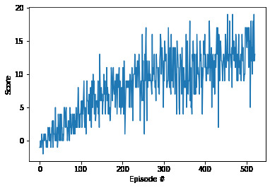

**Algorithm details:**
1. The agent uses Deep Q-Network (DQN) using Fully connected layers for computing the Q value as per the popular [DQN](http://files.davidqiu.com//research/nature14236.pdf) paper which is used to solve Atari Arcade games.
2. As per DQN, A Nueral Network is used for computing optimal Q-value for the state (state-value function approximator) and the action is computed from epislon-greed policy.
3. The hyperparemeter epsilon is reduced over the episodes so that initially more weightage is given for exploration and later to the knowledge. As per literature recommendations, the epsilon is reduced linearly over the episode.
4. A RelayBuffer is used to store the SARSA pair for each step of the agent.
5. The Nueral network is trained with the samples from the RelayBuffer which are taken with uniform distribution from it. This kind of disregards the temporal relation between consecutives state transitions.
6. DQN has two NN with same architecture, Local & Target networks. The architecture of the network is as follows,
   1. The Neural network has three Fully connected layers.
      1. Layer 1: Size: 37 * 128 i.e state_space_size * hidden_layer1_size
      2. Layer 2: Size: 128 * 64 i.e hidden_layer1_size * hidden_layer2_size
      3. Layer 3: Size: 64 * 4 i.e hidden_layer2_size * action_space_size
   2. The first two layers have ReLU activation unit 
   3. While the last layer is simply a linear layer to give Q-values directly without any activation unit.
   4. The number of nodes in the hidden layers and no of hidden layers are chosen based on experiments.
7. Local network is used to compute the Q-value for any given state whereas the target network is used to compute the Q value which is used to calculate the error.
8. The parameter of target network is updated from local network at a fraction rate.
9. The parameter of target network is updated at every n (4 in this case) steps.
10. Steps 8 & 9, make sures it avoids fluctuation due to high error in a single SARSA transition.
11. Some of the hyper parameter used in training are as follows,
    1. BUFFER_SIZE - _1e5_ - size of the relay buffer(mentioned above) to store the SARSA pairs - chosen based on experiments.
    2. BATCH_SIZE - _64_ - size of experiences from relay buffers used to train the networks at any time - chosen based on DQN paper.
    3. GAMMA - _0.99_ - the discount factor used in Expected return calculation - standard value of 0.99 is used giving more weights to future rewards.
    4. TAU - _1e-3_ - factor is used to soft update the target network weights from local network (described above) - as per the DQN paper.
    5. LR - _5e-4_ - learning rate used in Nueral network weight updates - chosen from experiments
    6. UPDATE_EVERY - _4_ - step count to update target weight from local network weigh - chosen as per DQN paper.

**Score vs episodes:**
1. The evironment is considered solved if the average score is +13 over the last iterations.
2. Plot of score against episodes during training is shown below.
3. If you look at the plot, we can use that the score is over 13 i.e average is +13, from episodes 421 to 521, hence we can consider the environment is solved at episode 421 i.e the scores after episode 421, are over 13. Or solved at episode 521 if we include the episodes which are used to compute the average values.
 
 

**Future ideas:**
1. Use Prioritized Experienced Relay - instead of picking samples with uniform distribution from the Relay buffer, we could pick them with probabilities computed from the error values.
   1. This makes the system to learn quickly as agent can learn from high error transition.Large error -> more the system can learn from that step.
2. Other ideas like Dueling Networks, Double DQN, etc.. can be used.
3. Use Raw pixel values rather than state space from the environment.
